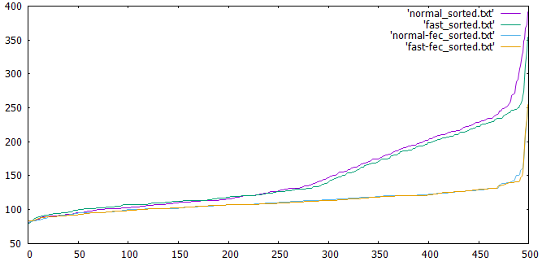

# kcpgo-fec-test

Test [kcp-go](https://github.com/xtaci/kcp-go) FEC

Derived from kcp-go kcp_test.go adding FEC.

To plot with [gnuplot](http://www.gnuplot.info/):
```
gnuplot --persist -e "plot 'normal_sorted.txt' with lines, 'fast_sorted.txt' with lines, 'normal-fec_sorted.txt' with lines, 'fast-fec_sorted.txt' with lines"
```
Or:
```
kcpgo-fec-test && cd output && gnuplot --persist -e "plot 'normal_sorted.txt' with lines, 'fast_sorted.txt' with lines, 'normal-fec_sorted.txt' with lines, 'fast-fec_sorted.txt' with lines" && cd ..
```
Or run [run_and_plot.bat](run_and_plot.bat).

Output example:
